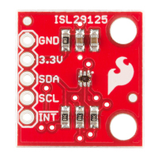
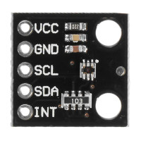

# MicroPython library for RGB sensors based on ISL29125 chip

## Sensor breakout boards

[SparkFun RGB Light Sensor ISL29125](https://www.sparkfun.com/products/12829)

[CJMCU-29125 ISL29125 RGB Color Light Sensor](https://www.banggood.com/CJMCU-29125-ISL29125-RGB-Color-Light-Sensor-Red-Green-Blue-Three-color-Light-Sensor-Module-p-1236412.html?cur_warehouse=CN)

[Datasheet ISL29125 sensor chip](resources/isl29125_datasheet.pdf)

[Schematic ISL29125 breakout board](resources/ISL29125_Breakout-v10.pdf)

## Features
* Operating Voltage: 3.3V
* Operating Current: 56µA
* I2C (SMBus compatible) interface
* Selectable operation modes (colors) 
* Light Intensity Range 375 Lux(dark) or 10K Lux (normal)
* ADC Resolution accuracy 12bit or 16bit
* Selectable IR filtering
* Selectable interrupt with color thresholds
* SCL, SDA, INT, 3.3V, & GND Pins Broken Out

## Pinout
Pin|Description
:--:|-----------
GND|Ground.
VCC|Power (3.3V).
SCL|I2C clock.
SDA|I2C data.
INT|Interrupt (active LOW) It remains at 3.3V until an interrupt condition is met, at which point it goes LOW (ground)

__!! This sensor is not 5V tolerant !!__

## Sensor config registers
Register|Description
:------:|-----------
CONFIG_1|Operation mode, what colors the sensor will sample.
CONFIG_1|Light Intensity Range : 275Lux* (dark) or 10KLux (normal).
CONFIG_1|Sensor accuracy : 12bit (fast, less accurate) or 16bit* (slow, more accurate).
CONFIG_1|Use INT pin (input) to trigger measurement or not*.
CONFIG_2|Range of IR filtering : lower* or upper.
CONFIG_2|Amount of IR filtering : low*, mid or high
CONFIG_3|No interrupts* or interrupt based on selected color.
CONFIG_3|Sensitivity : how many times the threshold is hit before interrupt triggers.
CONFIG_3|Trigger interrupt when sampling is complete* or when threshold is hit.

__(*) default value__

Register|Example|Description
:------:|-----------|-----------
CONFIG_1|CFG1_MODE_RGB __OR__ CFG1_10KLUX|Sample RGB values in bright conditions.
CONFIG_2|CFG2_IR_ADJUST_HIGH|Set IR filtering to high.
CONFIG_3|CFG3_R_INT __OR__ CFG3_INT_PRST8|Trigger interrupt on red values set to highest sensitivity.

__!! Different settings for the same config register are ORed together !!__

## MicroPython library

This library is based on the [ISL29125_Python library](https://github.com/dylanshuler11/ISL29125_Python) by dylanshuler11. 
He ported the  [SparkFun_ISL29125_Breakout_Arduino_Library](https://github.com/sparkfun/SparkFun_ISL29125_Breakout_Arduino_Library) to Python. Thanks for the heavy lifting. The port to MicroPython was not to difficult.

[Micropython library](isl29125.py)

[Example code](test_isl29125.py)

This code has been tested with ESP32 running MicroPython v1.15. It should also run with ESP8266 and Raspberry Pi Pico.

Enjoy :)
